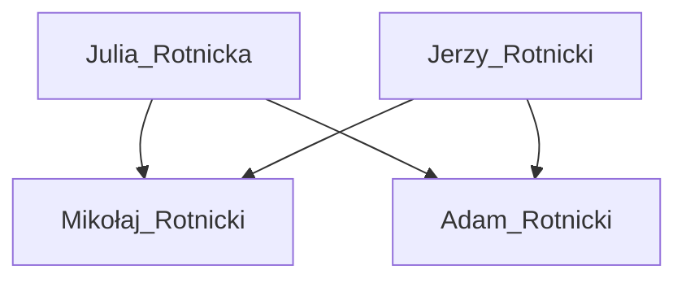

# Dzida
Z czego składa się dzida?

Kontakt do mnie poniżej



## Graf

## 1. Przeddzidzie dzidy

Lorem ipsum dolor sit amet, consectetur adipiscing elit. Maecenas ac pulvinar ligula, eu convallis quam. Mauris eget tempor nulla, sed viverra diam. Nunc accumsan nulla vel risus suscipit imperdiet. Nunc commodo egestas faucibus. Duis et elementum ipsum. Ut tempus neque ac commodo aliquam. Integer odio nulla, aliquam in lectus at, imperdiet molestie lacus. 

### 1.1 Przeddzidzie przeddzidzia dzidy

Integer leo nibh, tempor in mollis eget, fermentum sit amet urna. In convallis purus sed mauris vestibulum ultricies. Nam eget maximus ligula. Nunc iaculis mauris arcu, ac auctor justo accumsan ac. Vivamus tincidunt aliquam enim, non bibendum justo gravida nec. Praesent non sem eleifend, rhoncus ante quis, feugiat leo. Nunc in dictum neque. 

### 1.2 Śróddzidzie przeddzidzia dzidy

Nam sed auctor leo. Vivamus eros risus, consequat a sem vel, elementum imperdiet est. Lorem ipsum dolor sit amet, consectetur adipiscing elit. Donec nisi mi, vulputate ac elit maximus, condimentum aliquet est. Nullam varius fringilla nibh, in convallis odio scelerisque at. In et orci ut ex molestie ornare sit amet rhoncus tortor. Praesent non congue mauris. Quisque ullamcorper, est vitae vulputate bibendum, turpis justo pulvinar orci, ac fringilla augue eros varius tortor. Vestibulum varius dolor leo, in faucibus nibh pretium non. Fusce sit amet pellentesque magna. 

### 1.3 Zadzidzie przeddzidzia dzidy

Quisque ac tincidunt sem, eget porta tellus. Quisque varius augue leo, ut eleifend urna efficitur at. Maecenas placerat mauris ac feugiat convallis. Nulla facilisi. Fusce vestibulum quam ut leo dapibus vulputate. Suspendisse eget mollis urna. Nulla sollicitudin ipsum nunc, et suscipit sem iaculis quis. Mauris sollicitudin lectus lacus, et dignissim mi eleifend eu. Fusce eget mauris id velit imperdiet gravida. Nunc interdum leo maximus diam volutpat congue. Sed fermentum nec nisi ac sollicitudin. Aenean nec finibus lorem. Sed eget blandit nulla, id placerat nisl. Aliquam nec augue at justo vehicula dictum. 

## 2. Śróddzidzie dzidy

Donec ipsum ante, varius vel faucibus gravida, dignissim in quam. Vestibulum non aliquet velit. Donec id nisl at tortor efficitur dictum non in metus. Suspendisse tempus euismod risus, eget ultricies risus bibendum et. Vestibulum faucibus felis leo, id imperdiet lectus euismod id. Proin sit amet luctus elit. Nunc tempus commodo risus, vitae varius lectus venenatis quis. Etiam congue, libero in placerat egestas, velit justo consequat risus, porttitor lacinia orci erat ac purus. Nulla vel ultrices orci. Ut hendrerit purus id lectus aliquet, eu maximus lectus blandit. Mauris et leo a ante pharetra tempus non vel turpis. Ut condimentum facilisis nisi, vitae volutpat lorem pharetra eu.

### 2.1 Przeddzidzie śróddzidzia dzidy

Maecenas sed euismod lacus, eget facilisis sem. Donec hendrerit vehicula velit id bibendum. Nam quis dolor ac erat gravida maximus. Integer id cursus tellus. Integer tortor magna, luctus et euismod in, fermentum eu lectus. Nulla congue commodo dolor, sed tincidunt magna semper vitae. Donec ac lobortis libero. Nulla interdum augue et lectus rhoncus, in consequat neque aliquam. Nam aliquam, augue quis consequat porttitor, ante ipsum imperdiet est, sed congue odio nulla vel velit. Aenean vitae lectus id ipsum suscipit hendrerit. Morbi a metus pretium nisi lobortis cursus ac et nisl. Praesent auctor vitae dui facilisis lobortis. Pellentesque interdum pretium imperdiet. Donec non venenatis sapien, quis porttitor ante. 

### 2.2 Śróddzidzie śróddzidzia dzidy

Vivamus in aliquam quam. Cras euismod nunc nisl, sed aliquam ligula vulputate sed. Phasellus congue vestibulum mauris porta dictum. Donec vel nunc at neque posuere dignissim finibus ut risus. Maecenas at eros fermentum, tempus tellus sit amet, tincidunt nisi. Ut non pulvinar ante, ac tempor felis. Aliquam et odio in velit fermentum egestas. Aliquam eros nunc, blandit nec nunc vel, auctor vehicula sapien. Nunc pharetra et libero et rutrum. 

### 2.3 Zadzidzie śróddzidzia dzidy

Sed placerat est ut tellus egestas, eget fermentum nisi varius. Fusce ut nisl sed est placerat dapibus nec laoreet nisi. Maecenas tristique tristique justo, a imperdiet nulla blandit ac. Aenean aliquet, elit et tincidunt dapibus, massa nisi mollis justo, nec hendrerit erat risus at sem. Pellentesque pulvinar ac lectus sed tempus. Pellentesque habitant morbi tristique senectus et netus et malesuada fames ac turpis egestas. Ut elementum interdum pretium. Ut convallis diam massa, imperdiet tempus felis tempus eget. Etiam non malesuada nunc, vel pellentesque augue. Integer nisi mi, dictum et ex ut, congue cursus erat. Integer vulputate nunc leo, sit amet finibus felis blandit et. Integer id diam non nunc tincidunt lobortis. Proin eu mi congue, ultricies tortor volutpat, mattis turpis. Maecenas lacus massa, malesuada vitae egestas id, tristique pellentesque arcu. Nulla cursus euismod lacus id porttitor. Integer libero neque, accumsan ac dui eu, finibus vulputate justo. 

## 3. Zadzidzie dzidy

Nunc vel pellentesque arcu. Suspendisse ut laoreet enim. Sed sagittis ante sed nisl viverra, eu eleifend lectus fringilla. Phasellus vestibulum ligula quis dui rutrum tincidunt. Cras tristique dignissim accumsan. Ut cursus augue varius orci tincidunt venenatis. Phasellus sed eros vitae tellus luctus viverra consectetur id turpis. 

### 3.1 Przeddzidzie zadzidzia dzidy

Donec non sem sed orci pretium viverra vel quis erat. Duis tortor arcu, ullamcorper sed lectus sit amet, fringilla euismod tellus. Donec semper, quam nec egestas placerat, sapien massa venenatis libero, eu molestie nibh velit sed enim. Praesent id sagittis lacus. Donec dignissim mattis maximus. Sed elementum malesuada fringilla. Sed non mollis est, id consectetur urna. Aenean sed efficitur dolor. Sed pellentesque ornare diam, ac interdum est. Cras facilisis, sapien id interdum suscipit, risus dui tristique diam, nec vehicula dolor nulla a nulla. Etiam dictum et justo eget lacinia. Etiam auctor sapien in turpis hendrerit, eget semper massa consectetur. Nullam imperdiet est non erat blandit, at porta nisi tristique. 

### 3.2 Śróddzidzie zadzidzia dzidy

Vivamus blandit ipsum vestibulum, aliquam massa ac, euismod eros. Praesent interdum dictum est, sodales tincidunt nibh euismod at. Vivamus porta leo non nisi cursus, eu tempor nisl egestas. Mauris vulputate et arcu nec feugiat. Fusce congue convallis nunc, vitae pulvinar erat congue vitae. Sed sed quam porttitor, molestie justo vitae, lacinia tellus. Maecenas porta mattis nunc ut faucibus. Pellentesque faucibus blandit neque, non tincidunt turpis fringilla eget. Aenean molestie porttitor lorem vel dapibus. Vestibulum et nibh massa. Aliquam ornare urna non lectus consectetur, id egestas urna tincidunt. Fusce porta id purus eu hendrerit. Aenean finibus lectus ut tellus fringilla, ornare ultricies quam ullamcorper. Ut scelerisque quam ipsum, et bibendum justo faucibus dictum. Sed lorem diam, finibus at ligula quis, hendrerit posuere erat. 

### 3.3 Zadzidzie zadzidzia dzidy

Quisque dictum felis vitae tincidunt consectetur. Ut porta felis massa, a luctus velit fringilla consectetur. Vestibulum enim lorem, tempus sed consequat in, elementum vitae sem. Sed vehicula condimentum est. Sed eget consectetur nisl. Integer arcu massa, ornare et nisl at, accumsan efficitur urna. Integer sagittis neque sem, sed consectetur nunc sodales ut. Mauris vulputate tellus at risus auctor tempor. Duis accumsan ullamcorper metus. Cras eros ipsum, finibus ac nisl sit amet, semper mattis odio. Duis ornare nec mauris et sollicitudin. 
